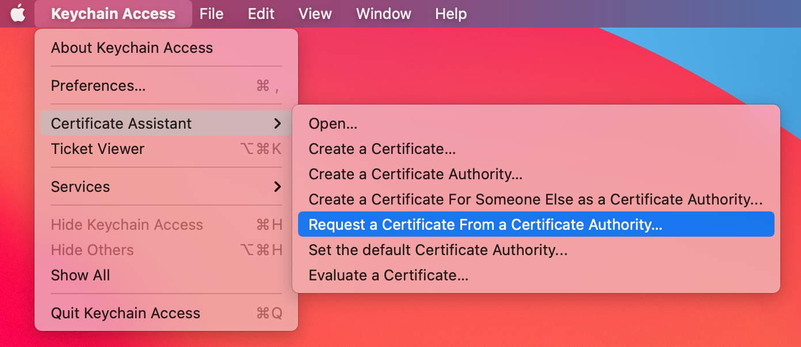
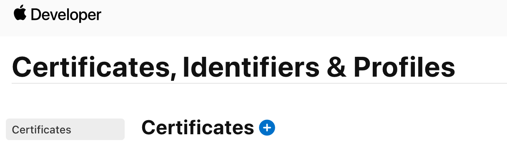
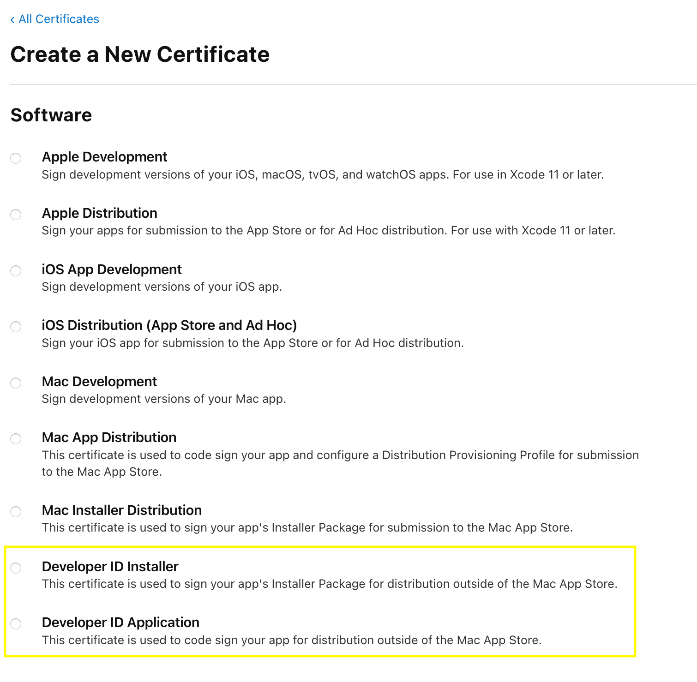
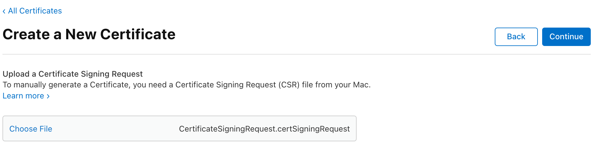

# Notarize a macOS app

## Why?

Apple [notarize](https://developer.apple.com/documentation/xcode/notarizing_macos_software_before_distribution/:
):
> Beginning in macOS 10.15, all software built after June 1, 2019, and distributed with Developer ID must be notarized.

> Enabling the ‘Hardened Runtime’ will be requirement for successful notarization starting January 2020.

## What you need

- 2 x `Code Signing certificates` from <https://developer.apple.com>
- 1 x `App-specific-passwords` from <https://appleid.apple.com/>
- 1 x `Certificate Signing Request` from `KeyChain`
- [Help to notarize](https://scriptingosx.com/2019/09/notarize-a-command-line-tool/)
 or [automated tool](https://github.com/electron/electron-notarize)

### Get Certificates from Apple Developer account

From a paid developer account or Enterprise account on <https://developer.apple.com>:

- Create a `Developer ID Application` for signing the binary
- Create a `Developer ID Installer` for signing the package [that contains the binary].
- Sign the same `Certificate Signing Request`

Download and install into `keyChain`.

#### Request a Certificate From a Certificate Authority



#### Login to developer.apple.com



#### Create two certificates



#### Sign each Certificate with the Certificate Signing Request



### Login to appleid.apple.com

Request an `app-specific password`.  Copy the value into `KeyChain`.  Create a `New Password Item` in `Keychain` with the following fields:

- `Keychain Item Name` Developer-altool
- `Account Name` apple developer account email
- `Password` the new application-specific password

### List the code signing certificate from KeyChain

```bash
security find-identity -p basic -v            
  5) 629......005A5 "Developer ID Installer: Mickey Mouse (U8.......)"
  6) 79F......C0126 "Developer ID Application: Mickey Mouse  (U8.......)"
```

Copy the 40 character identifiers for the downloaded certificates.  Also note the Team ID. The Team ID ( `U8...`) is a 10 character GUID.

### Set environment variables

```bash
export APP_DEV_ID=<Developer ID Application>
export PKG_DEV_ID=<Developer ID Installer>
export BUNDLE_ID="com.rusty.notarizetest"
export INSTALL_LOC="/usr/local/bin"
export APPLE_USERNAME=<email>
export TEAM_ID=<>
export FOO_APP="foo"
export FOO_PKG=${FOO_APP}.pkg
```

### Verify whether the app is code signed

`codesign --verify ${FOO_APP} --verbose`

### Add entitlements

Create an empty `macOS command line` app and add the entitlements required.  Copy that entitlements file.  <https://github.com/electron/electron-notarize> suggests you needd some `entitlements`:

```js
    com.apple.security.cs.allow-jit
    com.apple.security.cs.allow-unsigned-executable-memory
```

### Sign the binary with Entitlements + App Hardening

The `runtime` flag is required for the `notarization` to pass.  

```bash
codesign --entitlements cli_empty_macos.entitlements --force --options runtime --timestamp --sign ${APP_DEV_ID} ${FOO_APP}

foo-cli: valid on disk
foo-cli: satisfies its Designated Requirement
```

### Add the code into a Package file

```bash
pkgbuild --root ~/src \
           --identifier ${BUNDLE_ID} \
           --version "1.0" \
           --install-location ${INSTALL_LOC} \
           --sign ${PKG_DEV_ID} \
           ${FOO_PKG}
```

### Verify package was signed correctly

`pkgutil --check-signature ${FOO_PKG}`

### Submit for notarization

```bash
xcrun altool --notarize-app \
             --primary-bundle-id ${BUNDLE_ID} \
             --username ${APPLE_USERNAME} \
             --password "@keychain:Developer-altool" \
             --asc-provider ${TEAM_ID} \
             --file ${FOO_PKG}
```

Check the Apple response and `export REQUEST_ID=<big long string>`.

### check status

```bash
xcrun altool --notarization-info ${REQUEST_ID} \
             --username ${APPLE_USERNAME} \
             --password "@keychain:Developer-altool"   
```

### Final step - staple the ticket to package

After a success email, you can staple the `notarization` to the package:

```bash
xcrun stapler staple ${FOO_PKG}

Processing: foo-cli1.0.pkg
The staple and validate action worked!
```

### Hurdles

When I tried a `zip` file, I would constantly hit the following error.  I moved to `pkg` and no error:

>ITMS-90728: Invalid File Contents - The contents of the file foo.zip do not match the extension. Verify that the contents of the file are valid for the extension and upload again.

The following error file was down to missing the `pkgbuild` step [ which signs the package or zip ]:

```json
{
  "logFormatVersion": 1,
  "jobId": ".....",
  "status": "Invalid",
  "statusSummary": "Archive contains critical validation errors",
  "statusCode": 4000,
  "archiveFilename": "foo.zip",
  "uploadDate": "2021-03-15T16:19:39Z",
  "sha256": "....",
  "ticketContents": null,
  "issues": [
    {
      "severity": "error",
      "code": null,
      "path": "foo.zip/usr/local/bin/foo",
      "message": "The binary is not signed with a valid Developer ID certificate.",
      "docUrl": null,
      "architecture": "x86_64"
    },
    {
      "severity": "error",
      "code": null,
      "path": "foo.zip/usr/local/bin/foo",
      "message": "The signature does not include a secure timestamp.",
      "docUrl": null,
      "architecture": "x86_64"
    },
    {
      "severity": "error",
      "code": null,
      "path": "foo.zip/usr/local/bin/foo",
      "message": "The executable does not have the hardened runtime enabled.",
      "docUrl": null,
      "architecture": "x86_64"
    }
  ]
}
```

### Remove apple's Security attribute on app

You don't have to do any of this.  But this is not a pro choice, if the command line tool is going beyond your control:

`xattr -d com.apple.quarantine`
